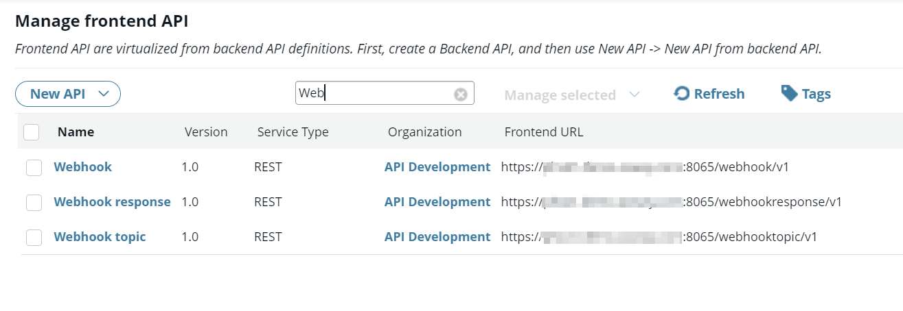
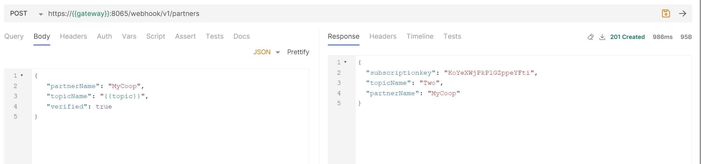
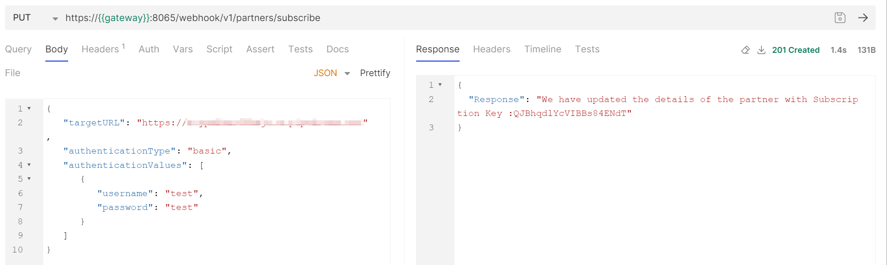
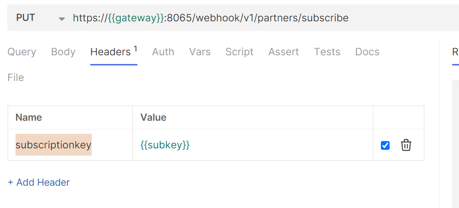
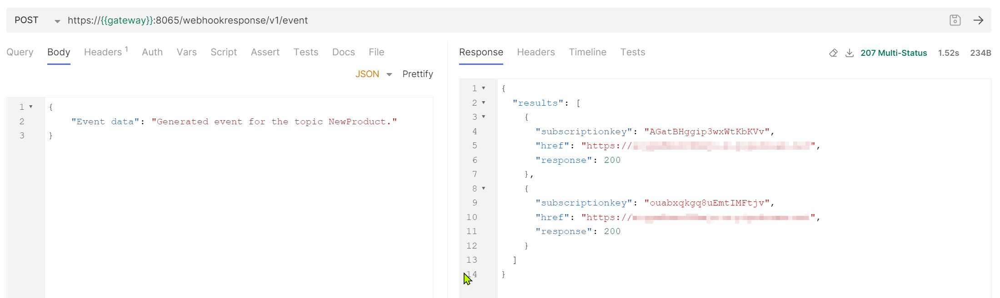
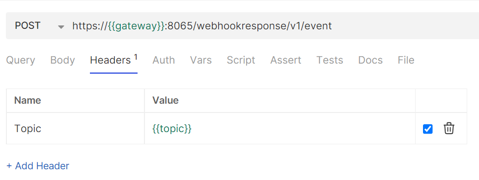
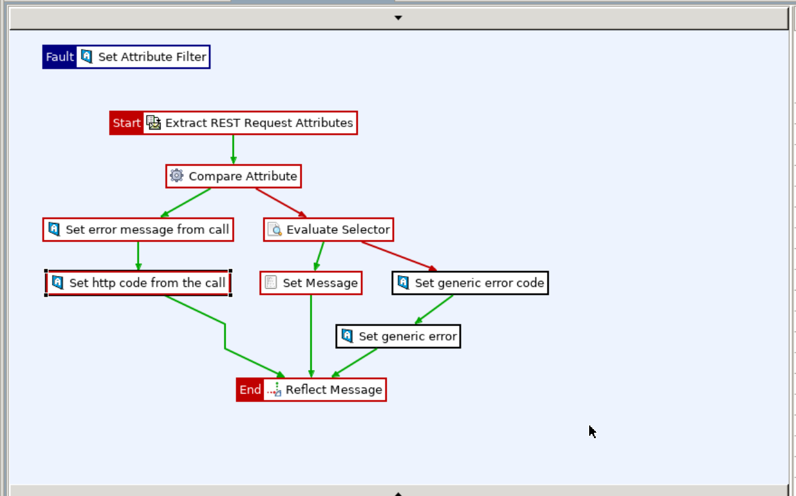

# A sample implementation of Webhook in Axway API Management

This project provides a sample of the implementation of Webhook. This is the general flow in the scenario:

1. A provider (who will generate events) creates a new Topic.
2. A partner/client registers for a Topic.
3. A partner/client sets the registration details (e.g. Webhook URL and authentication).
4. A provider generates an event.
5. Registered partners/clients receive an event data.

The project uses KPS to store all data. You will need to authenticate these KPS API calls using a user ID that can update KPS tables.

## Setup

The project contains several files in the [Webhook_impl](./Webhook_impl) folder that constitute the entire solution:

- Policy Studio artifacts:
  - **WebhookAPI.xml** - this file contains policies that implement the Consumer side of the interaction and a user ID for accessing KPS data (**kpsadmin** with the *KPS Administrator* role). 
  - **WebhookTopicAPI.xml** - this file contains policies that allow the Provider to create a new topic.
  - **WebhookResponseAPI.xml** - this file contains policies to publish new event data.
  - **Webhook_KPS.xml** - this file contains KPS table definitions.
- API Manager artifact:
  - **api-export.dat** - this file contains the collection of APIs exported from the API manager. The password is **changeme**.

You also need to add a new environment variable to the **<INSDTALL_DIR>apigateway/groups/<GROUP_id>/<INSTANCE_ID>/conf/envSettings.props** file:

```bash
env.VM.HOSTNAME=<hostname where you run APIM>
```

### Importing artifacts

1. Open Policy Studio. 

2. Use the **Import Configuration Fragments** option to import the Policy Studio artifacts. FYI, REST APIs are exposed through the **Default Services** listener.

3. Go to **External Connections > Client Credentials > HTTP Basic** and edit the password for the **kps admin** entry.  

> [!IMPORTANT]
>
> Make sure that this user ID is configured in API Gateway Manager.

   

4. Deploy this configuration to the target API Management instance.

5. Log into API Manager.

6. Import API collection (*api-export.dat*; the password is **changeme**).

The following screen capture shows the APIs used in the project:



## Creating a topic (role: Provider)

A provider uses the Webhook topic API to create a new topic. This API is <u>not</u> exposed to the partners/clients. This is an example of the body:

```json
{
    "topicName": "{{topic}}"
}
```


## Register a partner/client (role: Consumer or Provider)

The Webhook API should be accessible to the partners/clients. To register for a specific topic, they will use the Webhook's API method called **Register a user for a topic**. This is a sample call with payload and response:



This call will return **subscriptionkey** that should be used for other API calls related to this subscription.

Clients will need to update their initial user information with a Webhook URL and authentication information. They will use the **Update subscription details** method in the *Webhook* API. The following screen capture shows a sample call:



You must include the **subscriptionkey** header with the value of the subscription key returned in the previous call:



At this point, any event generated for the subscribed topic will be sent to the registered Webhook URL.

## Generate event (role: Provider)

An events provider will use the Webhook response API to generate a new event. The example call is shown in this screen capture:



You will need to add the Topic header for this call:




## Updating policies

This project is an example of how one can implement Webhook support. You can extend or modify the implementation in Policy Studio. You can start by reviewing the APIs in the REST API Repository and what policies are used for each method. 

> [!IMPORTANT]
>
> This sample project is not bulletproof. The production-like implementation was not the goal of the project. Rather, it should be one of the possible ways to support Webhook, and let developers extend it with desirable features.


## Error handling

Most of the errors during policy execution are reported with a custom message in a JSON format and a special header - that is included if an error is generated. You can create a global fault handler where you check for this special header to add any custom handling of these errors. The following policy flow shows that it checks for the presence of the **ConnectError** header (**Compare Attribute** filter). When it is present, the error message and HTTP status code are copied from the API call and returned to a caller:

